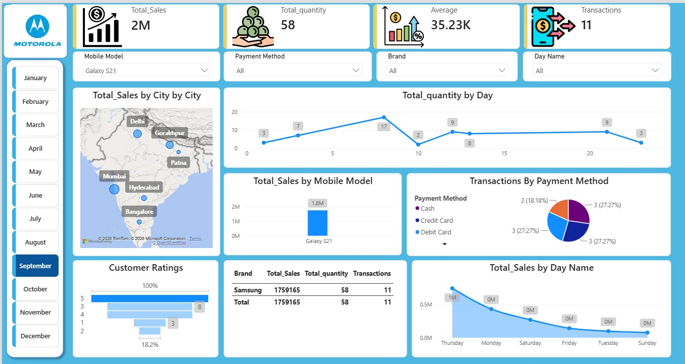
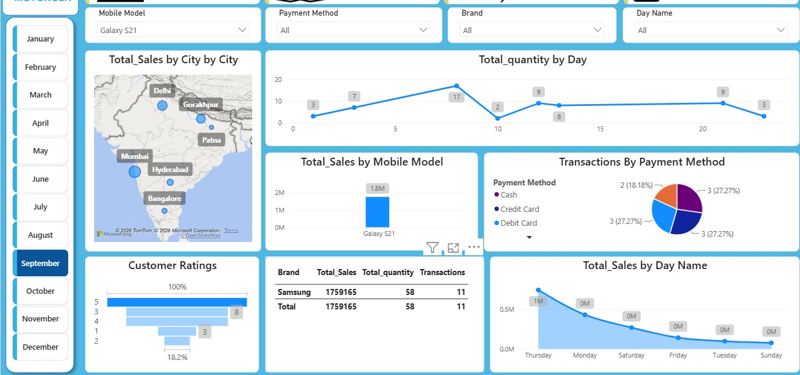

 📱 Mobile Phone Sales Analysis Dashboard

An interactive Power BI dashboard analyzing mobile phone sales data across cities, brands, models, and payment methods — built to surface sales trends, top performers, and customer behavior patterns.

 📊 Overview

This dashboard provides a single-page view of mobile phone sales performance, combining KPI summaries, geographic analysis, and trend charts to support data-driven decision-making.

 🖼️ Screenshots

✨ Key Features

- **KPI Cards** — Total Sales, Total Quantity Sold, Total Transactions, and Average Order Value at a glance
- **Sales by City (Map)** — geographic breakdown of revenue across locations
- **Sales Trend (Line Chart)** — quantity sold over time, broken down by month and day
- **Sales by Mobile Model (Column Chart)** — top and bottom performing models
- **Payment Method Distribution (Pie Chart)** — share of transactions by payment type
- **Customer Ratings (Funnel Chart)** — distribution of customer satisfaction scores
- **Sales by Day of Week (Area Chart)** — identifies peak sales days
- **Brand-wise Summary Table** — sales, quantity, and transactions broken down by brand
- **Interactive Slicers** — filter by brand, mobile model, payment method, day of week, and date

 🛠️ Tools & Skills Used

- **Power BI Desktop** — report design and data visualization
- **Power Query** — data cleaning and transformation
- **DAX** — calculated measures (totals, averages, aggregations)
- **Data Modeling** — relationships between sales and date tables

 📁 Files

- `Mobile Sales Dashboard .pbix` — full Power BI report file
- `dashboard-overview.jpeg`, `DashBoard KPI.jpeg`, `sales-breakdown.jpeg` — dashboard preview images

💡 Insights

*(Add 2–3 real findings once you review the data, e.g.:)*
- [Brand] generated the highest share of total sales revenue
- [City] had the highest transaction volume
- [Payment Method] was the most commonly used payment option

 ▶️ How to View

1. Download `Mobile Sales Dashboard .pbix`
2. Open it in [Power BI Desktop](https://www.microsoft.com/en-us/power-platform/products/power-bi/downloads) (free)

---
